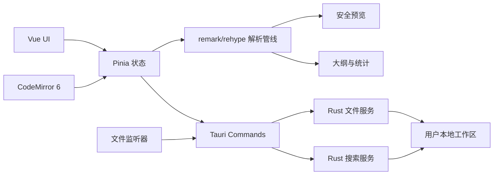
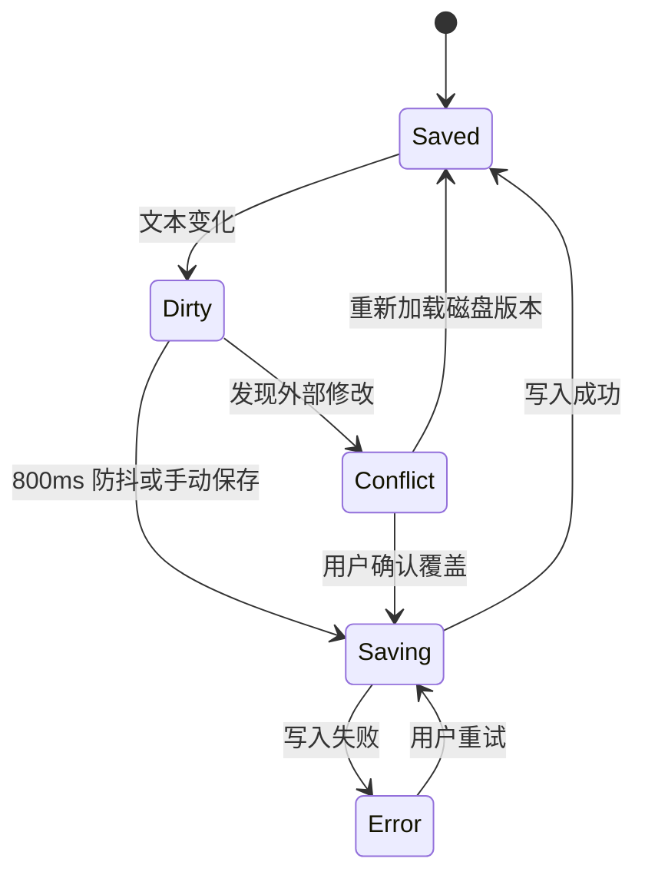

# MD来了本地版技术与界面设计文档

> 文档状态：Draft v0.1  
> 对应需求：[PRD.md](./PRD.md)

## 1. 技术选型

### 1.1 推荐技术栈

| 层级 | 技术 | 用途 |
| --- | --- | --- |
| 桌面壳 | Tauri 2 + Rust | 窗口、系统菜单、本地文件访问、原子写入、文件监听 |
| 前端 | Vue 3 + TypeScript + Vite | UI 与业务状态 |
| 编辑器 | CodeMirror 6 | Markdown 编辑、语法高亮、搜索、行号和扩展机制 |
| Markdown | unified/remark/rehype | GFM 解析、AST、大纲、HTML 渲染和安全过滤 |
| 状态管理 | Pinia | 工作区、编辑会话、设置和 UI 状态 |
| 样式 | Tailwind CSS + CSS Variables | 快速搭建界面与主题 token |
| 本地搜索 | Rust `ignore` + `grep-searcher` | 遍历工作区并进行流式文本搜索 |
| 文件监听 | Rust `notify` | 监测外部创建、修改、重命名和删除 |
| 测试 | Vitest + Vue Test Utils + Playwright | 单元、组件和端到端测试 |

### 1.2 选择理由

- Tauri 安装包和内存占用通常小于 Electron，适合本地工具。
- Rust 负责文件系统边界，可集中处理权限、编码、原子写入和路径安全。
- CodeMirror 6 对大文本、扩展能力和 Markdown 编辑支持成熟。
- unified 生态可以让预览、大纲、统计和导出共享同一棵 Markdown AST，减少规则不一致。
- Vue 单文件组件与组合式 API 适合快速构建复杂桌面工具界面，也便于后续增加设置页、版本历史和协作面板。

### 1.3 首版不采用的方案

- 不使用数据库保存文档正文；正文始终是用户目录中的普通 Markdown 文件。
- 不启动本地 HTTP 服务；前后端通过 Tauri command/event 通信。
- 不引入登录 SDK、云存储 SDK、遥测或远程配置。

## 2. 总体架构



### 2.1 进程职责

前端 WebView：

- 渲染所有 UI。
- 管理当前编辑内容、光标、布局和临时交互状态。
- 解析 Markdown，生成预览、大纲和统计。
- 发起受控的文件操作请求。

Rust 核心：

- 校验所有路径必须位于已授权工作区内。
- 读取目录、读取文件、原子写入、重命名和移动到系统回收站。
- 扫描与搜索工作区。
- 监听外部文件变化并向前端发送事件。
- 保存应用级配置和最近工作区列表。

## 3. 前端模块设计

```text
src/
├─ app/                 # 应用初始化、路由、错误边界
├─ components/          # 通用 UI 组件
├─ features/
│  ├─ workspace/        # 欢迎页、工作区切换
│  ├─ explorer/         # 文件树与文件操作
│  ├─ editor/           # CodeMirror 封装、编辑工具栏
│  ├─ preview/          # Markdown 渲染与滚动同步
│  ├─ outline/          # 标题树与定位
│  ├─ search/           # 搜索框与结果面板
│  ├─ statistics/       # 文档统计
│  ├─ export/           # HTML 导出
│  └─ settings/         # 设置页
├─ stores/              # Pinia stores
├─ services/            # Tauri IPC、解析和存储适配器
├─ styles/              # 全局样式与主题 token
└─ types/               # 共享类型
```

### 3.1 状态划分

`workspaceStore`

- `rootPath`
- `tree`
- `expandedDirectories`
- `recentWorkspaces`
- `watcherStatus`

`documentStore`

- `activeDocument`
- `content`
- `diskVersion`
- `dirty`
- `saveStatus`
- `cursorPosition`
- `externalConflict`

`uiStore`

- `viewMode`
- `leftSidebarOpen`
- `rightSidebarOpen`
- `splitRatio`
- `theme`
- `activeRightPanel`

`settingsStore`

- `fontSize`
- `fontFamily`
- `tabSize`
- `autoSaveDelay`
- `syncScroll`
- `ignoredPatterns`

## 4. Rust 核心模块

```text
src-tauri/src/
├─ commands/
│  ├─ workspace.rs
│  ├─ files.rs
│  ├─ search.rs
│  ├─ export.rs
│  └─ settings.rs
├─ services/
│  ├─ atomic_writer.rs
│  ├─ path_guard.rs
│  ├─ file_watcher.rs
│  └─ text_encoding.rs
├─ models/
├─ error.rs
└─ lib.rs
```

### 4.1 建议的 Tauri Commands

| Command | 输入 | 输出 | 说明 |
| --- | --- | --- | --- |
| `open_workspace` | 目录路径 | 工作区摘要 | 校验并授权工作区 |
| `list_directory` | 相对路径 | 文件节点数组 | 懒加载目录内容 |
| `read_text_file` | 相对路径 | 内容、mtime、hash | 仅允许 UTF-8 文本 |
| `write_text_file` | 相对路径、内容、预期 hash | 新 mtime、hash | 原子写入并检测冲突 |
| `create_file` | 相对路径 | 文件节点 | 自动补全扩展名 |
| `create_directory` | 相对路径 | 目录节点 | 创建目录 |
| `rename_entry` | 原路径、新路径 | 文件节点 | 禁止越出工作区 |
| `trash_entry` | 相对路径 | 成功状态 | 移动到系统回收站 |
| `search_workspace` | query、limit、requestId | 流式结果 | 支持取消旧请求 |
| `export_html` | 源 HTML、目标路径 | 成功状态 | 写出独立 HTML |

### 4.2 文件事件

Rust 向前端发送统一事件 `workspace://file-changed`：

```ts
type FileChangeEvent = {
  kind: 'created' | 'modified' | 'renamed' | 'removed';
  path: string;
  oldPath?: string;
  mtime?: number;
};
```

应用自身写入文件时附带短期 operation token，文件监听器据此去重，避免把自动保存误判为外部冲突。

## 5. 本地数据与配置

### 5.1 文档数据

- 文档正文：保存在用户选定的工作区中。
- 不修改 Markdown 内容以写入应用元数据。
- 工作区不强制生成隐藏配置目录。

### 5.2 应用配置

配置写入操作系统提供的应用数据目录，例如：

```json
{
  "version": 1,
  "theme": "system",
  "fontSize": 15,
  "tabSize": 2,
  "autoSaveDelay": 800,
  "syncScroll": true,
  "splitRatio": 0.5,
  "recentWorkspaces": []
}
```

配置文件不包含文档内容。最近工作区只记录本地绝对路径与最后打开时间。

## 6. Markdown 解析与安全

建议解析管线：

```text
Markdown
  → remark-parse
  → remark-gfm
  → remark-rehype
  → rehype-sanitize
  → rehype-highlight
  → Vue/HTML Preview
```

- 默认不启用原始 HTML；后续如增加该选项，也必须经过白名单清理。
- 禁止 `script`、事件属性、`javascript:` URL、iframe 和远程可执行内容。
- 本地图片路径通过受控 asset protocol 加载，只允许访问当前工作区。
- 外部链接交给系统浏览器打开，并在打开前校验协议为 `http` 或 `https`。

## 7. 自动保存与冲突处理

### 7.1 保存状态机



### 7.2 原子写入

1. 检查磁盘文件 hash 是否与打开时一致。
2. 在同目录写入临时文件。
3. 刷新临时文件到磁盘。
4. 使用操作系统支持的替换操作覆盖目标文件。
5. 返回新的 mtime 和 hash。

如果第 1 步检测到外部修改，则不覆盖目标文件，返回 `FILE_CONFLICT`。

## 8. 搜索设计

- 文件树采用懒加载，搜索服务独立遍历目录。
- 使用 `.gitignore` 语义过滤 `.git`、`node_modules` 和用户自定义忽略项。
- 每个搜索请求包含 `requestId`；新查询发起后取消旧查询。
- 单次默认最多返回 200 个命中，单文件最多 20 个片段。
- 结果按文件名精确匹配、文件名包含、正文命中依次排序。
- 首版不维护持久化索引，避免数据库与外部文件状态不一致；性能不足时再引入 SQLite FTS5。

## 9. 界面视觉规范

### 9.1 设计方向

- 整体采用接近参考图的浅色专业工具风格，强调内容而不是装饰。
- 顶部栏高 64 px；左侧栏默认宽 260 px；右侧栏默认宽 280 px。
- 编辑区和预览区默认等宽，最小宽度均为 320 px。
- 使用 8 px 基础间距体系，圆角以 6–8 px 为主。

### 9.2 色彩 token（浅色）

| Token | 建议值 | 用途 |
| --- | --- | --- |
| `--bg-app` | `#F7F8FA` | 应用背景 |
| `--bg-panel` | `#FFFFFF` | 面板背景 |
| `--border` | `#E5E7EB` | 分隔线 |
| `--text-primary` | `#171A21` | 主文字 |
| `--text-secondary` | `#667085` | 次级文字 |
| `--accent` | `#2563EB` | 主按钮、选中态 |
| `--accent-soft` | `#EAF2FF` | 选中背景 |
| `--success` | `#16A34A` | 已保存 |
| `--danger` | `#DC2626` | 错误与危险操作 |

### 9.3 字体

- UI：系统字体栈，Windows 优先使用 `Segoe UI` 与 `Microsoft YaHei UI`。
- 编辑器：`JetBrains Mono`、`Cascadia Code`、系统等宽字体。
- 预览正文：16 px，行高 1.75；正文最大阅读宽度 860 px。

### 9.4 组件状态

- 文件选中：浅蓝背景、蓝色文件名、左侧 2 px 强调条。
- 悬停：仅改变背景，不移动元素。
- 焦点：2 px 蓝色焦点环，键盘操作始终可见。
- 危险操作：红色文字，确认弹窗中的主操作使用红色按钮。
- 保存状态：文字与图标结合，不只依赖颜色。

## 10. 主要界面草图

```text
┌──────────────────────────────────────────────────────────────────────────┐
│ M+  工作区        搜索…          产品需求文档.md  ✓ 已保存   ◐  ⚙        │
├──────────────┬──────────────────────┬──────────────────────┬─────────────┤
│ + 新建文件   │ H B I  列表 链接…    │                      │ 大纲        │
│              ├──────────────────────┤  Markdown 实时预览   │ ├ 产品概述  │
│ 最近文件     │ 1  # 标题            │                      │ ├ 核心功能  │
│ 收藏         │ 2                    │  # 标题              │ └ 功能清单  │
│              │ 3  正文内容…         │                      ├─────────────┤
│ 工作区       │                      │  正文内容…           │ 字数统计    │
│ ▾ 产品文档   │                      │                      │ 612 字      │
│   PRD.md     │                      │                      │ 78 行       │
│   计划.md    │                      │                      │ 阅读 2 分钟 │
├──────────────┴──────────────────────┴──────────────────────┴─────────────┤
│ 行 3，列 8    字数 612     Markdown     空格: 2       自动保存：开启     │
└──────────────────────────────────────────────────────────────────────────┘
```

响应式规则：窗口宽度低于 1100 px 时默认折叠右侧栏；低于 800 px 时不显示双栏，编辑和预览通过顶部按钮切换。

## 11. 错误模型

Rust 层返回结构化错误：

```ts
type AppError = {
  code:
    | 'PERMISSION_DENIED'
    | 'NOT_FOUND'
    | 'INVALID_PATH'
    | 'INVALID_ENCODING'
    | 'FILE_CONFLICT'
    | 'WRITE_FAILED'
    | 'UNKNOWN';
  message: string;
  path?: string;
  recoverable: boolean;
};
```

前端根据 `code` 映射用户可理解的中文提示，并在可恢复时给出明确操作。

## 12. 测试策略

### 12.1 单元测试

- Markdown 标题提取、字数与阅读时间计算。
- 路径边界校验和路径规范化。
- 保存状态机、搜索排序和设置迁移。
- HTML 安全过滤规则。

### 12.2 集成测试

- 打开工作区、目录懒加载与文件监听。
- 原子写入成功、失败和 hash 冲突。
- 新建、重命名、移动到回收站。
- 搜索取消、忽略目录和结果限制。

### 12.3 端到端测试

- 首次启动到创建并保存第一篇文档。
- 编辑 Markdown 后预览、大纲和统计同步更新。
- 外部修改文件后冲突提示与三种处理路径。
- 重启应用恢复工作区、当前文件、主题和布局。

## 13. 开发阶段建议

### 阶段 A：工程骨架（2–3 天）

- Tauri、Vue、TypeScript、样式系统和 CI。
- 主布局、主题 token、错误边界和设置存储。

### 阶段 B：核心闭环（5–7 天）

- 工作区授权、文件树、读取、CodeMirror 编辑和原子保存。
- Markdown 预览、大纲、统计和三种显示模式。

### 阶段 C：桌面能力（4–5 天）

- 文件操作、系统回收站、外部变化监听和冲突处理。
- 工作区搜索、HTML 导出与系统快捷键。

### 阶段 D：质量与发布（3–5 天）

- 自动化测试、性能优化、深色主题、缩放与键盘可访问性。
- Windows 安装包、升级前兼容性检查和发布说明。

单人全职开发的 MVP 预估为 3–4 周；若要求同时打磨 Windows 与 macOS，建议增加 1–2 周兼容性验证。

## 14. 预留扩展点

- 文件存储抽象保留 `DocumentRepository` 接口，未来可以增加加密备份或远端同步实现。
- 右侧信息栏采用可注册 panel 结构，后续可加入评论、历史版本和协作者。
- 保存成功事件可接入本地快照服务，但首版不创建版本副本。
- 分享功能未来应以显式发布副本为基础，避免直接暴露用户工作区路径。
- 同步功能未来需要独立的冲突模型，不能复用简单的本地文件 hash 覆盖逻辑。
